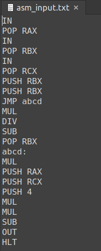

# Assembler and Processor
## Description
While working on the project, I learned how to work with bit masks, binary file and own stack.
This program creates an assembly file and passes it to the processor for calculation.
## Build and Run
1) Cloning repository:
```
git clone git@github.com:maksimra/asm_and_proc.git
```
2) Go to the folder with assembler:
```
cd asm_and_proc/Assembler
```
3) You should create .txt file which contains assembly code (in this folder).
4) Compiling:
```
make
```
5) To create executable code, type:
```
objects/output "name_of_file_with_assem_code.txt" "output_file"
```
6) To move in folder with processor:
```
cd ../Processor
```
7) Compiling:
```
make
```
8) To calculate:
```
objects/output "asm_output.txt"
```
### Example:

